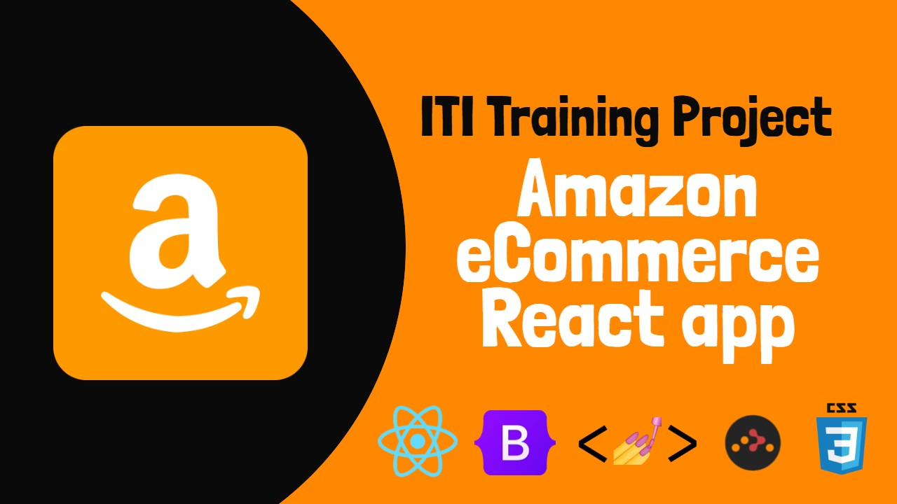

# ITI Graduation Project August-2021

<p>
  
</p>

> **Amazon** an E-Commerce application Built mainly with **React.js**

### 🌍 Overview For the Project
 **This is an E-Commerce website named "Amazon" for selling Electronics like : mobile phones , tablets , laptops , etc**
<br>
**Amazon app consists of 6 pages ( components )**

- Landing page
  - welcome page and some stats. of app
- About Page
  - some information about me with external links to my social accounts
  - Feel Free to connect
- Registration Page
  - sign up into amazon
- Products Page
  - what Amazon sells
- Cart Page
  - where your buyed products goes
- 404 Page
  - if you go to /blablabla or something not found
- Must signup page
  - when you try to access products page without registration
<hr>

### 👨‍💻 Technical Overview For the Project
**Technologies used :**
- React.js
- React Router Dom
- Boostrap
- ReactStrap
- Styled Components
- Font Awesome
- Sweet Alert 2
- PayPal Api

<hr>

### 📥 For installation
**open CLI in your Text Editior inside the project folder and Type this command**

```npm
npm install
```
**This will do 2 important things**
- Install all required modules
- Open the project on a LocalHost on your default Browser

<hr>

### 😉 Tips & Tricks
- Fork & Star the project
- Feel free to give your opinion
