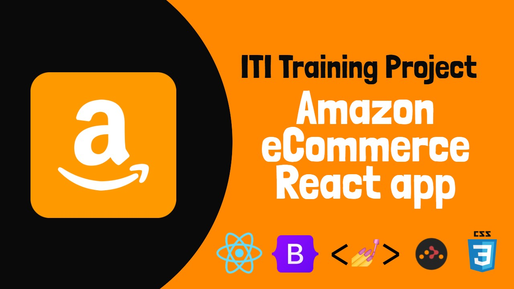

# ITI Graduation Project August-2021

<p>
  
</p>

> **Amazon** an E-Commerce application Built mainly with **React.js**

### 🌍 Overview For the Project
 **This is an E-Commerce website named "Amazon" for selling Electronics like : mobile phones , tablets , laptops , etc**
<br>
**Amazon app consists of 6 pages ( components )**

- Landing page
  - welcome page and some stats. of app
- About Page
  - some information about me with external links to my social accounts
  - Feel Free to connect
- Registration Page
  - sign up into amazon
- Products Page
  - what Amazon sells
- Cart Page
  - where your buyed products goes
- 404 Page
  - if you go to /blablabla or something not found
- Must signup page
  - when you try to access products page without registration
<hr>

### 👨‍💻 Technical Overview For the Project
**Technologies used :**
- React.js
- React Router Dom
- Boostrap
- ReactStrap
- Styled Components
- Font Awesome
- Sweet Alert 2
- PayPal Api

<hr>

### 📥 For installation
**Live demo:** https://ecommerce-reactjs-website.vercel.app

Requirements: Node.js 18 or newer and npm.

```sh
git clone https://github.com/fadyehabamer/Ecommerce-Reactjs-Website.git
cd Ecommerce-Reactjs-Website
npm ci          # install the exact versions from package-lock.json
npm start       # dev server on http://localhost:3000
```

Other scripts:

| Command | What it does |
| --- | --- |
| `npm test` | Runs the Jest tests in watch mode (`CI=true npm test` runs them once). Covers the cart logic in `src/Context.test.js` and route smoke tests in `src/App.test.js`. |
| `npm run build` | Creates a production build in `build/`. |

The project uses `react-scripts` 4 (webpack 4). The `start` and `build` scripts pass `--openssl-legacy-provider` so that they work on Node 17+ (OpenSSL 3).

**Deployment:** the site is hosted on Vercel with the Create React App preset (build command `npm run build`, output directory `build`). The preset already serves `index.html` for client-side routes like `/cart`.

<hr>

### 😉 Tips & Tricks
- Fork & Star the project
- Feel free to give your opinion
